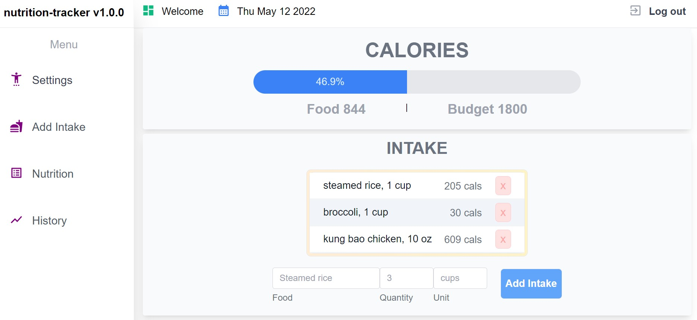
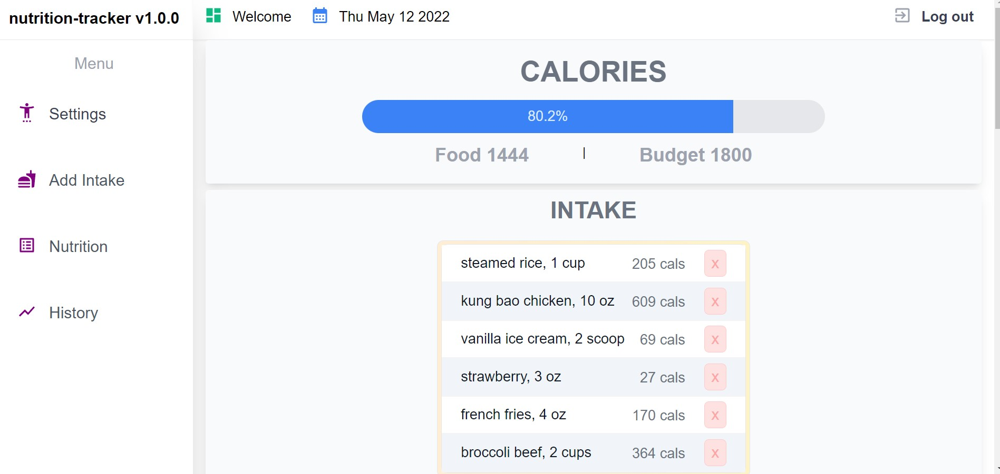
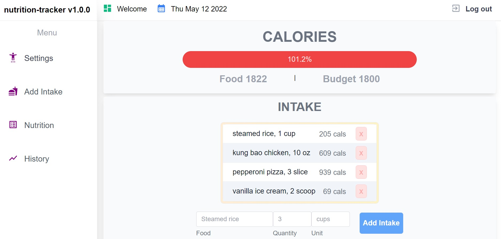
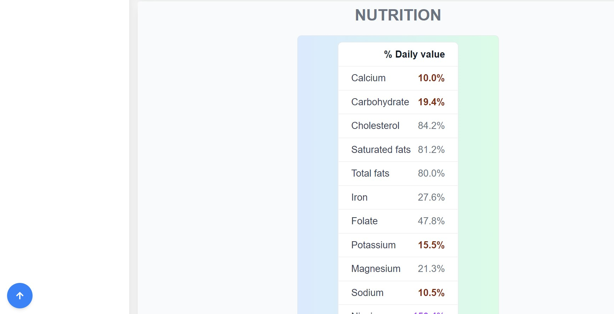
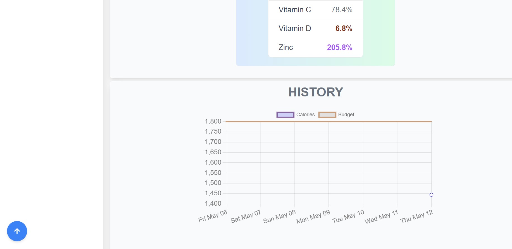
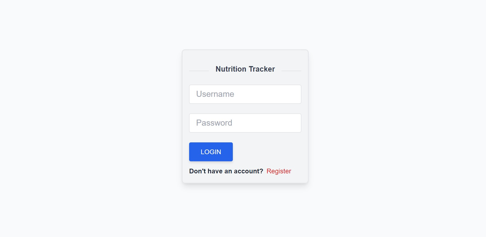
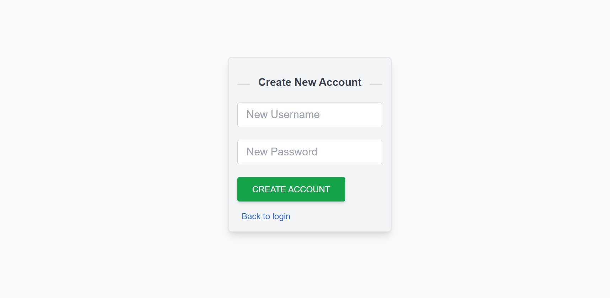

# Nutrition Tracking app

- Leveraged Edamam Nutrition Analysis API to provide nutritional content of searched food.
- Utilized Express and PostgreSQL on the back end to store data in relational tables.
- Utilized React and Tailwind CSS to create reusable front end components and uniformize code base.
- Utilized Webpack to bundle files

## Screenshots

